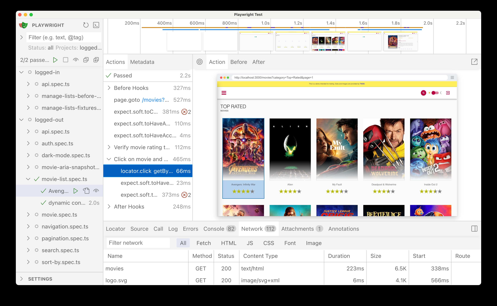

# Playwright Movies App

This repository provides a comprehensive guide to writing end-to-end tests with [Playwright](https://playwright.dev/), covering a wide range of scenarios to ensure your application is robust and reliable. Learn how to write tests for Authentication, Search, Sorting, API and API mocking, ARIA snapshots, and more.

The source code is a demo Movies App built with Next.js and React, utilizing the [The Movie Database (TMDB)](https://www.themoviedb.org/) API for testing purposes. This project is a fork of [next-movies](https://github.com/tastejs/next-movies) and has been customized to meet our specific requirements.



## Installation 

Clone the repository and then install the dependencies:

```bash
git clone https://github.com/debs-obrien/playwright-movies-app.git
cd playwright-movies-app
npm install
```


## Environment Setup for Login Tests

To run the login tests, you need to set up environment variables in a `.env` file. You can do this by renaming the `.env.example` file to `.env`, which already contains the necessary variables. Note that this app uses a mock backend, so any username and password will work.

## Running Tests

Run the tests using UI mode to walk through a trace of each test:

```bash
npx playwright test --ui
```

Alternatively, you can run the tests directly in VS Code with the [Playwright VS Code extension](https://marketplace.visualstudio.com/items?itemName=ms-playwright.playwright).


## Running the APP locally

Make sure port 3000 is available as the app needs to run on this port. Using a different port will result in errors because the movies loaded from the API use this port.

* `npm run dev`: dev build
* `npm run build`: production build
* `npm run start`: start the project

## Wiki

Check out the [wiki](https://github.com/debs-obrien/playwright-movies-app/wiki) for more info on the contents of each folder.

## License

[MIT](https://choosealicense.com/licenses/mit/)
